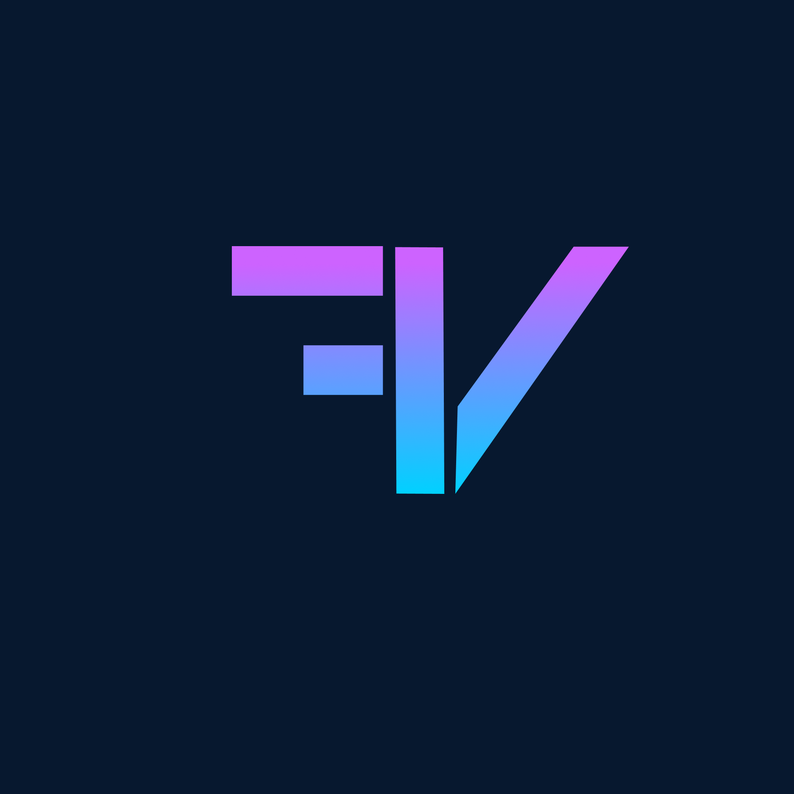
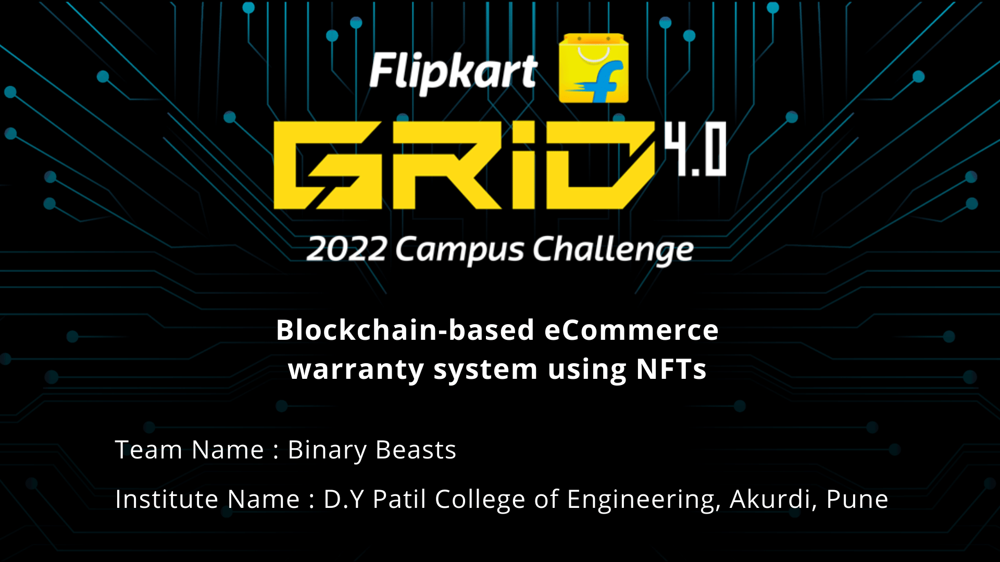
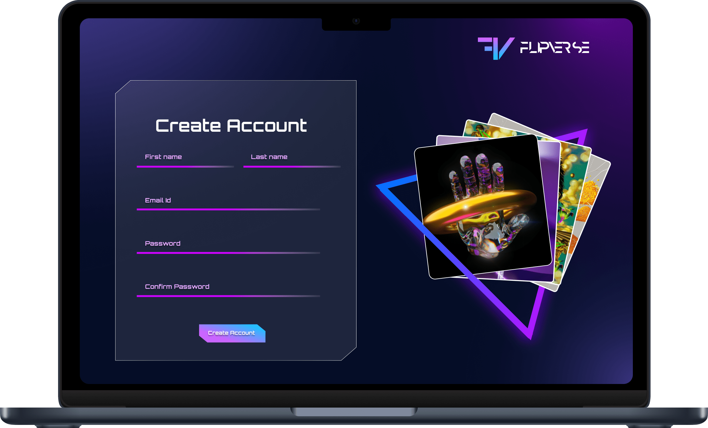
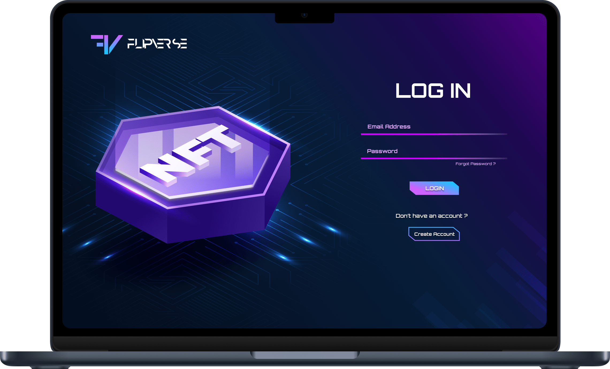
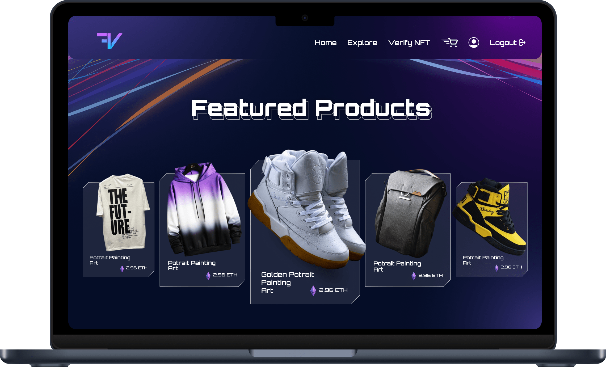
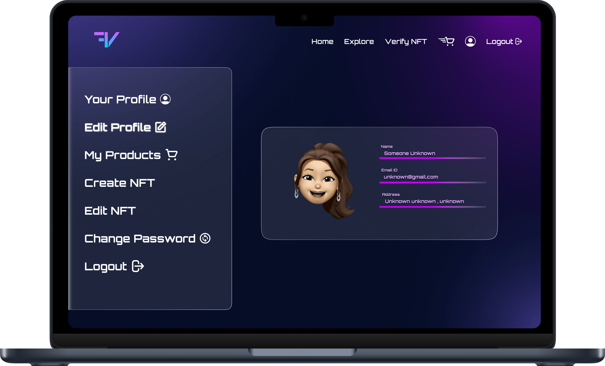
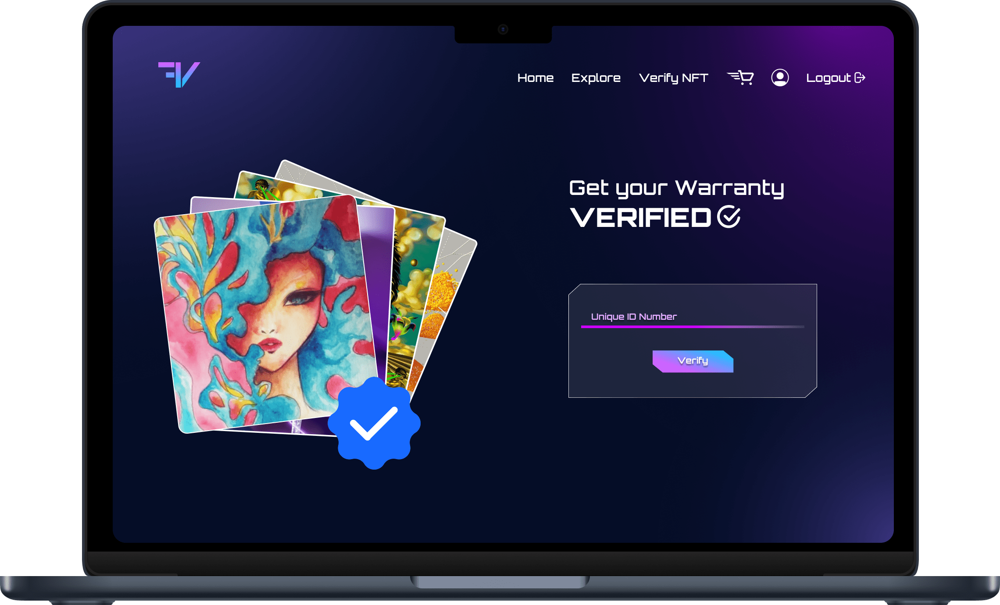
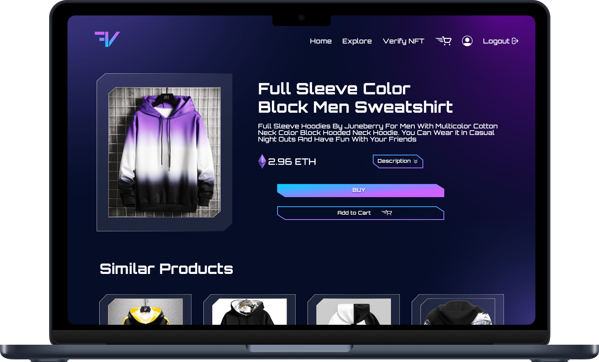
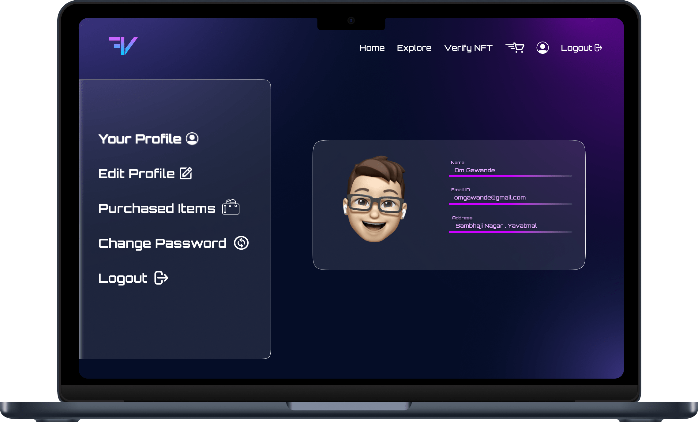
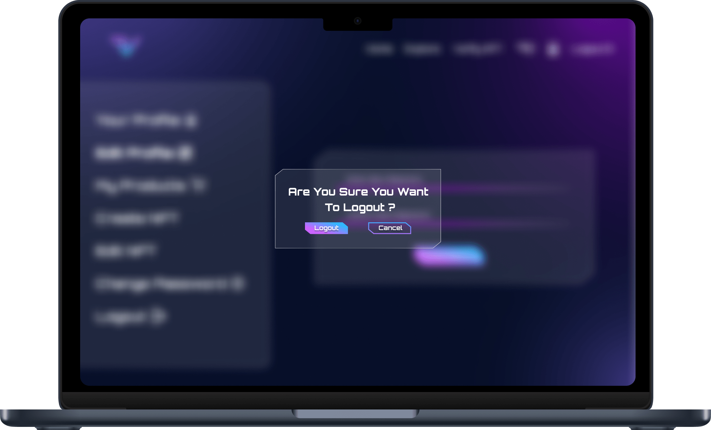

--- 

<h1 align="center">  <b> FlipVerse </b></h1>
<!-- PROJECT LOGO -->

<h2><b>🔗 Blockchain-based eCommerce warranty system using NFTs</b></h2>

  
# [DEMO LINK](https://drive.google.com/drive/folders/19cvw5LuK_1Fj5fdzUyr_fM02fHjEWQxd?usp=sharing)

  

  
---

  

---

<table>
  <tr>
    <td></td>
    <td></td>
  </tr>
  <tr>
    <td></td>
    <td></td>
  </tr>
  <tr>
    <td></td>
    <td></td>
  </tr>
  <tr>
    <td></td>
    <td></td>
  </tr>
</table>

---

## About the Site 🚀

---

Blockchain-based eCommerce warranty system using NFTs
The objective is to replace the physical warranty and have block chain based warranty using NFT which will ensure
authenticity and security.

 

● Converting ownership authenticity and product warranty cards into decaying NFTs.📉 
● For instance, allow brands and retailers to introduce an NFT for each of their products, which allows
customers to receive the physical product along with a digital version of it.🚀 
● Customers can then use the digital NFT to verify the authenticity of their product, prove their ownership of their product, and transfer ownership of them upon resale.🎯 
● The brand/retailer should also be able to tie the digital NFT to its warranty program, allowing owners to trackrepairs and replacements to the original item.🤩 
● Decay the NFT once the warranty is over.🥸 
● WE used the Polygon blockchain to deploy our solution and demo the final product as a web prototype🔗 

---

## Tech Stack 💻

---

### WEB 3.0 :

- Hardhat 
  

- Moralis 
  

- Solidity 
  

- Ethereum 
  

### Frontend :

 

### Backend :

 

### Designed On:

#### Figma File : [Figma Design Link](https://www.figma.com/file/WRhwvCUDoIyLwGBzBd0U9n/Flipkart-Grid-4.0)
#### Canva PPT : [Canva PPT Link](https://www.canva.com/design/DAFH52JWG8w/8DjZjxHVXOMLV7WrOY5j_g/view?utm_content=DAFH52JWG8w&utm_campaign=designshare&utm_medium=link2&utm_source=sharebutton)

## Contributors ✨

Thanks goes to these wonderful people ([emoji key](https://allcontributors.org/docs/en/emoji-key)):

<!-- ALL-CONTRIBUTORS-LIST:START - Do not remove or modify this section -->
<!-- prettier-ignore-start -->
<!-- markdownlint-disable -->
<table>
  <tr>
    <td align="center"><a href="https://github.com/Spyware007"> <b>OM GAWANDE</b></a> <a href="https://github.com/Spyware007/FlipVerse/commits?author=Spyware007" title="Code">💻</a> <a href="#ideas-Spyware007" title="Ideas, Planning, & Feedback">🤔</a> <a href="#projectManagement-Spyware007" title="Project Management">📆</a> <a href="#maintenance-Spyware007" title="Maintenance">🚧</a></td>
    <td align="center"><a href="https://nishant-bhosale.netlify.app/"> <b>Nishant Bhosale</b></a> <a href="https://github.com/Spyware007/FlipVerse/commits?author=Nishant-Bhosale" title="Code">💻</a> <a href="#ideas-Nishant-Bhosale" title="Ideas, Planning, & Feedback">🤔</a> <a href="#projectManagement-Nishant-Bhosale" title="Project Management">📆</a> <a href="#maintenance-Nishant-Bhosale" title="Maintenance">🚧</a></td>
    <td align="center"><a href="https://github.com/SaurabhBarde-007"> <b>Saurabh Barde</b></a> <a href="#content-SaurabhBarde-007" title="Content">🖋</a> <a href="#design-SaurabhBarde-007" title="Design">🎨</a> <a href="#ideas-SaurabhBarde-007" title="Ideas, Planning, & Feedback">🤔</a> <a href="https://github.com/Spyware007/FlipVerse/pulls?q=is%3Apr+reviewed-by%3ASaurabhBarde-007" title="Reviewed Pull Requests">👀</a></td>
  </tr>
</table>

<!-- markdownlint-restore -->
<!-- prettier-ignore-end -->

<!-- ALL-CONTRIBUTORS-LIST:END -->

This project follows the [all-contributors](https://github.com/all-contributors/all-contributors) specification. Contributions of any kind welcome!
